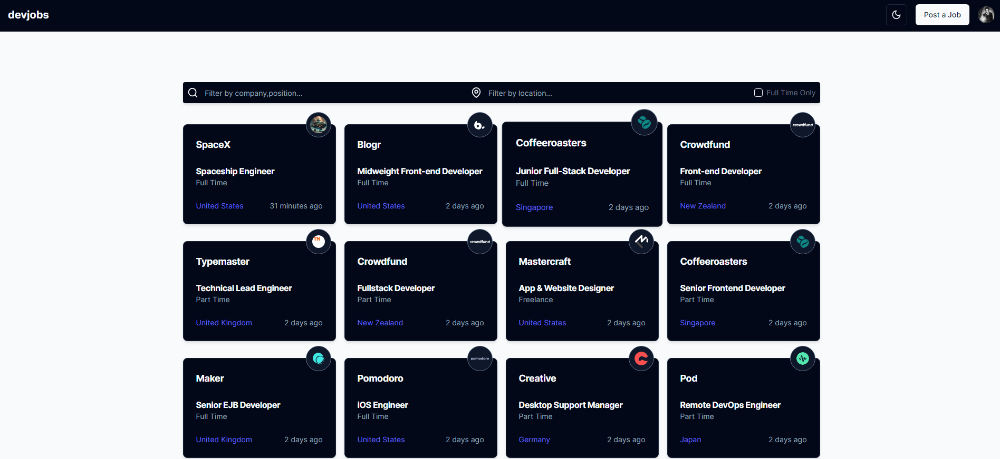

# Dev Jobs App

## Used Technologies

- React
- Next.js
- Tailwind CSS
- TypeScript
- Prisma
- MongoDB
- Clerk (Auth)

## Project Description

This project is a job board for developers. It is a fullstack application that uses Next.js, Tailwind CSS, TypeScript, Prisma, MongoDB and Clerk for authentication.
You can create a job offer, edit it, delete it and apply for it. You can also see all the job offers that are available and filter them by location, job type and job level.

<!--  Picutre Preview -->

